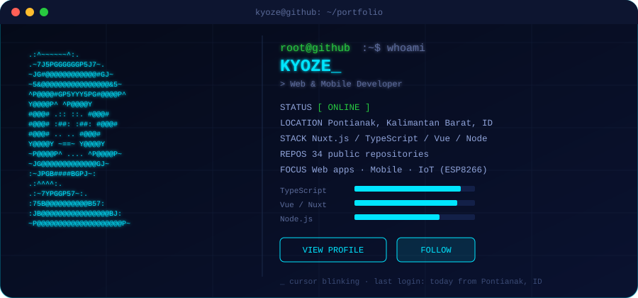

  

  

  
  

---

### 😎 About Me

- 🔭 Currently building web & mobile products with **Nuxt 3**, **TypeScript**, and modern JS tooling
- 🌱 Always exploring new tech — from full-stack web apps to **IoT (ESP8266)** projects
- 💬 Ask me about **Vue/Nuxt, TypeScript, Laravel, or embedded IoT**
- ⚡ Fun fact: I love turning messy ideas into clean, working products

---

### 🛠️ Tech Stack

  
  
  
  
  
   
  
  
  
  
  

---

### 📊 GitHub Stats

  
  

  

  

---

### 📌 Featured Projects

  
  
   
  
  

> 💡 Tip: kamu bisa pin 6 repo favorit langsung dari GitHub profile kamu (klik "Customize your pins" di tab Overview) supaya sinkron dengan kartu di atas.

---

### 🤝 Let's Connect

  

  

<i>⭐️ Thanks for stopping by! Feel free to explore my repos.</i>

